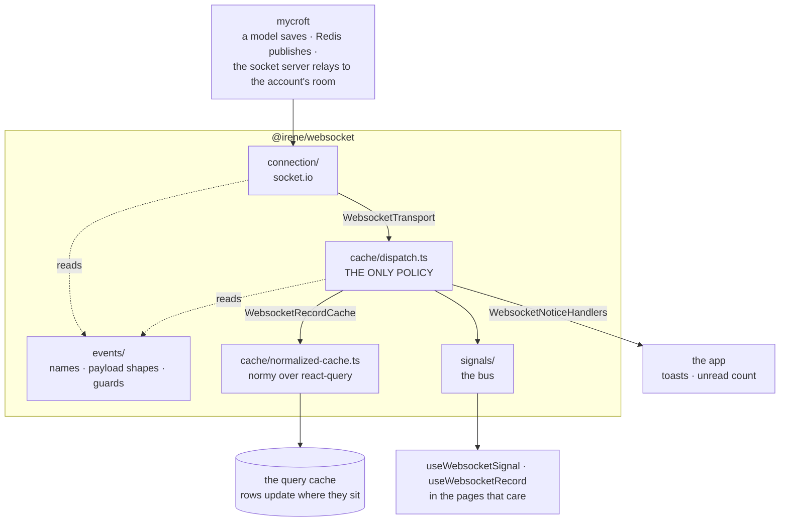
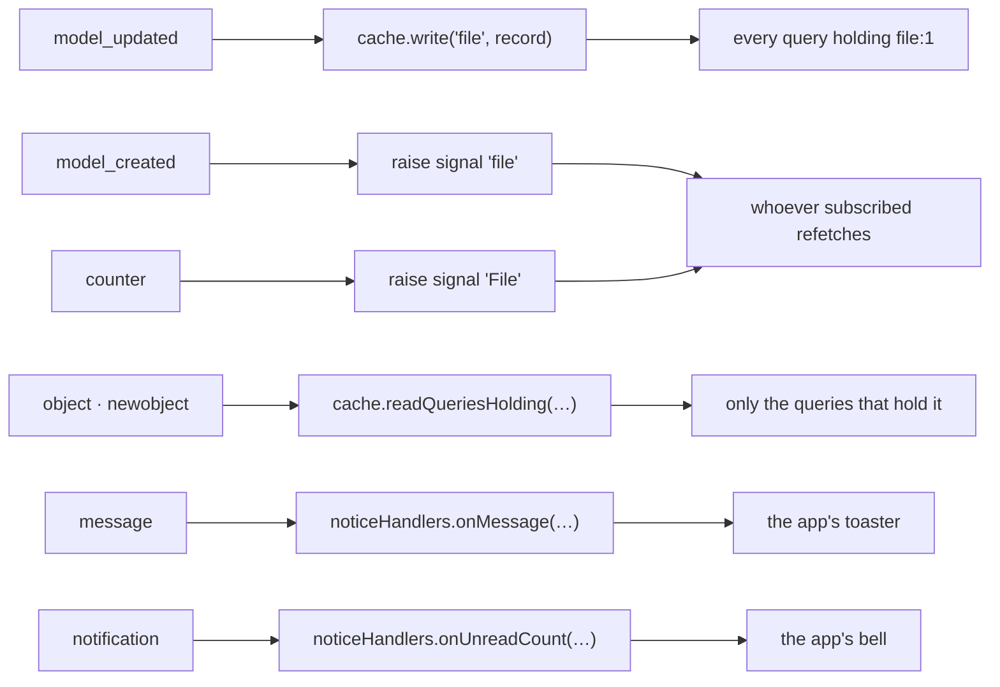

# @irene/websocket

The account's websocket: what the server pushes over it, and what that does to
the query cache.

It also holds the two other ways data arrives live — polling, for what the
server changes without sending anything, and device streams, which are their
own sockets per device — because a screen reaching for one of them is choosing
between all three.

Installable on its own. It depends on `@irene/api` and nothing else of ours — no
design system, no app — so each app supplies the two things only it knows: the
room the account's events arrive in, and what to do with what the server writes
for a person to read.

What the root exports is what an app may use. The policy, the record keys and
the socket itself are reachable only from inside, and the resets a test needs
are in `@irene/websocket/testing`.

## How it fits together



`WebsocketNoticeHandlers` has no adapter inside the package, because the app is
the adapter. The dispatch reaches a socket, a query cache and a screen only through
those three interfaces, so it is tested with three plain objects, and replacing
socket.io or normy touches one adapter.

### What happens to one event



Nothing in the middle column knows which queries an app has. The cache answers
the record events from what it holds; the rest are named for a subscriber to
recognise.

## Layout

Each layer imports only the ones above it.

| Path          | What is in it                                             |
| ------------- | --------------------------------------------------------- |
| `events/`     | the socket's contract: names, payload shapes, guards      |
| `connection/` | the account's socket: open, close, join the room          |
| `signals/`    | the bus: named subjects, and records as they arrive       |
| `cache/`      | what each event does to the query cache                   |
| `polling/`    | for what the server changes without saying so             |
| `streams/`    | device connections, which are per device, not per account |
| `hooks/`      | what an app and its pages call                            |

## What arrives, and what happens to it

| Event                 | What the server sends       | What happens                                                            |
| --------------------- | --------------------------- | ----------------------------------------------------------------------- |
| `model_updated`       | a record, in full           | written into the normalized cache, which reaches every query holding it |
| `model_created`       | a record, in full           | raised as a signal, since no query holds a record nobody has read       |
| `object`, `newobject` | a record's id and type      | the queries holding that record are read again, 300ms after the burst   |
| `counter`             | a model's class name        | raised as a signal                                                      |
| `message`             | a line of text and a level  | handed to the app to show                                               |
| `notification`        | an unread count per product | written onto the bell, for this app's product                           |

Nothing here knows which queries an app has. A record is found by what it is,
and everything else is named for a subscriber to recognise.

## Starting it, per app

Once, from the layout every signed-in page renders inside:

```ts
useWebsocketConnection({
  socketId: useSignedInUser()?.socket_id, // the room the account's events arrive in
  product: WEBSOCKET_PRODUCTS.appknox, // whose counts this app's bell shows
  onMessage: showWebsocketMessage, // how this app puts text on screen
});
```

And `QueryNormalizerProvider` above the app's `QueryClientProvider`:

```tsx
<QueryNormalizerProvider queryClient={queryClient} normalizerConfig={NORMALIZER_CONFIG}>
  <QueryClientProvider client={queryClient}>{children}</QueryClientProvider>
</QueryNormalizerProvider>
```

## Using it, per page

**Rows that update themselves.** Tag the records in the service and nothing else
is needed — no subscription, no key:

```ts
const { items, ...page } = transformPaginatedResponse(
  await apiRequest.get<ApiPageEnvelope<ApiFile>>(FileEndpoints.list(), { params })
);

return { ...page, items: items.map((file) => tagRecordForCaching('file', file)) };
```

A `model_updated` then reaches that row in every list, table and detail view
holding it, at any depth.

**Reloading when there is more of something.** A creation or a count says only
that something changed, so a page says what it cares about:

```ts
useWebsocketSignal('Invitation', () =>
  queryClient.invalidateQueries({ queryKey: invitationKeys.all() })
);
```

**Acting on a record, not just showing it.** Only when the screen has to do
something besides display the new values:

```ts
useWebsocketRecord('dynamicscan', (scan) => setActiveRun(scan));
```

**Raising a signal from the client.** After a mutation, so lists reload without
waiting for the server to say so:

```ts
raiseWebsocketSignal('Submission');
```

Handlers can be written inline — they are held for the life of the component, so
passing an arrow does not resubscribe or reopen anything.

## Polling

For what the server changes without an event:

```ts
useQuery({
  ...reportOptions(reportId),
  ...pollUntil({ intervalMs: 3000, isDone: (report) => report?.status === 'completed' }),
});
```

It stops when the data says it is done and again after `DEFAULT_POLL_ATTEMPTS`
reads, and pauses while the tab is in the background.

## Device streams

A device connection is per device and authorized by its own token, not by the
session:

```ts
const socket = new WebSocket(deviceStreamUrl(token));

holdDeviceSession(serial, session); // reused by the next screen
heldDeviceSession(serial); // and kept alive while it is asked for
releaseDeviceSession(serial); // closed now
```

Connecting is slow and the user moves between screens while it runs, so a
session outlives the component that opened it and is closed after ten idle
minutes. Signing out calls `releaseAllDeviceSessions()`.

## Why a record carries its kind

Ids are unique per kind and not beyond it — file 1 and analysis 1 both exist —
so the cache keys a record as `file:1`. `__record` is added by the client and
never sent by the server, so a request body built from a cached record must drop
it rather than post it back.

## Performance

The socket costs the same in every app: one connection, one room, and a message
volume set by the account's activity.

What scales with an app is normalization — every successful query's data is
walked to key the records in it. Untagged data is a shallow walk; a query whose
payload is large and whose rows are never pushed can opt out with
`meta: { normalize: false }`. Keep react-query's structural sharing on, which
lets an identical refetch skip normalizing at all.

Invalidation is bounded by what is mounted: react-query reads only active
queries, and a signal only reaches the pages that subscribed.
